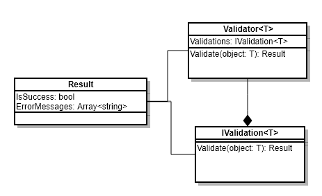

# Validator
Generic validation pattern

Use this pattern when you need to execute 'n' number of validations against a given object, ascertain success, and act or report on the errors detected.

## Diagram:


## Implementation steps
*Code examples pulled from `src/validator/tests/PersonValidator.spec.ts`*
1. Extend Validator<T>
```ts
class PersonValidator extends Validator<Person> {
  constructor(personValidations: Array<IValidation<Person>>) {
    super(personValidations);
  }
}
```
2. Implement `IValidation`(s)
```ts
class NameValidation implements IValidation<Person> {
  Validate(object: Person): Result {
    const result = new Result();
    const nameValid = object.Name && object.Name.length >= 1;

    if (!nameValid) {
      result.ErrorMessages.push('Invalid name - must be at least one character');
    }

    return result;
  }
}
```
3. Instantiate validator
```ts
personValidator = new PersonValidator([
  new NameValidation(),
  new AgeValidation()
]);
```
4. Call `Validate`, passing an object of type `T` and make use of the result returned
```ts
  // Success unit test example
  it('should return successful response when no errors are detected', () => {
    const person = new Person('Joey Bayes', 28);

    const validationResult = personValidator.Validate(person);

    expect(validationResult.IsSuccess).toBeTruthy();
    expect(validationResult.ErrorMessages.length).toEqual(0);
  });

  // Failure unit test example
  it('should return failed result when one or more errors are detected', () => {
    const person = new Person('', -1);

    const validationResult = personValidator.Validate(person);

    expect(validationResult.IsSuccess).toBeFalsy();
    expect(validationResult.ErrorMessages.length).toEqual(2);
  });
```